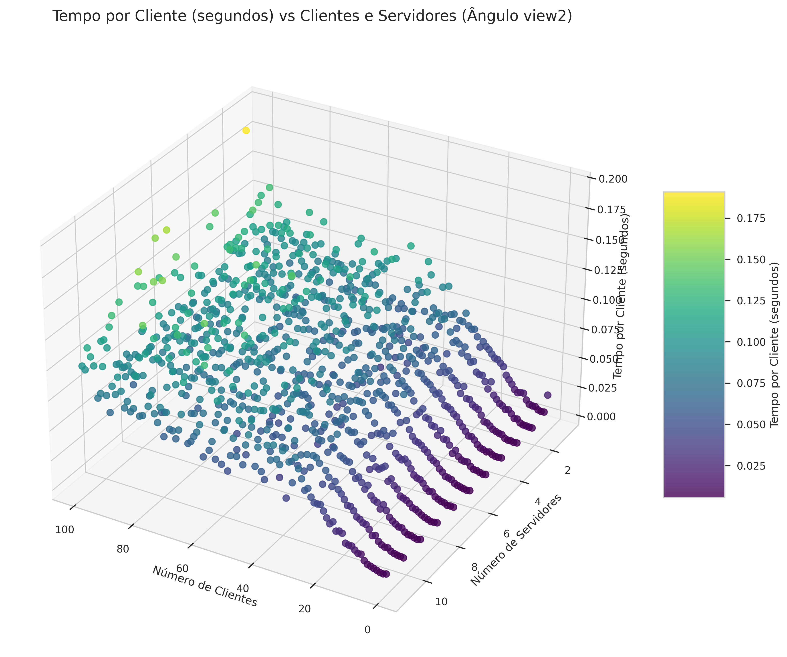
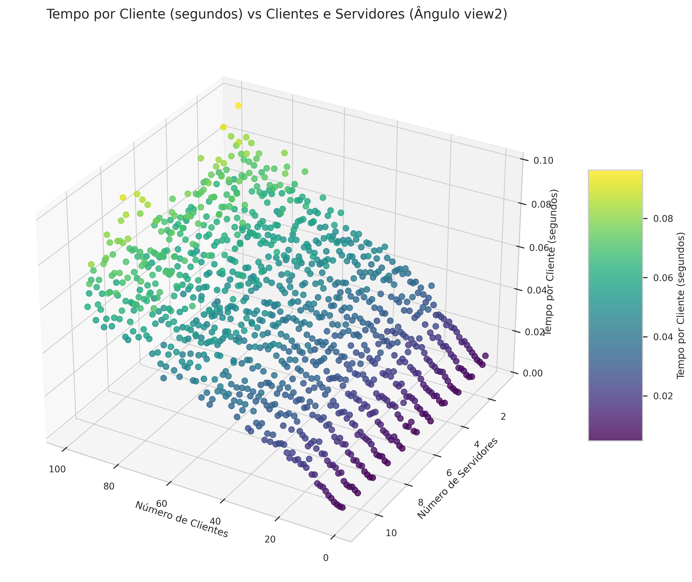
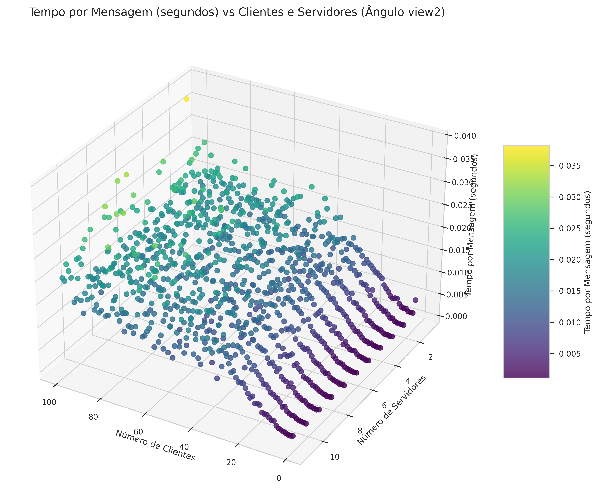
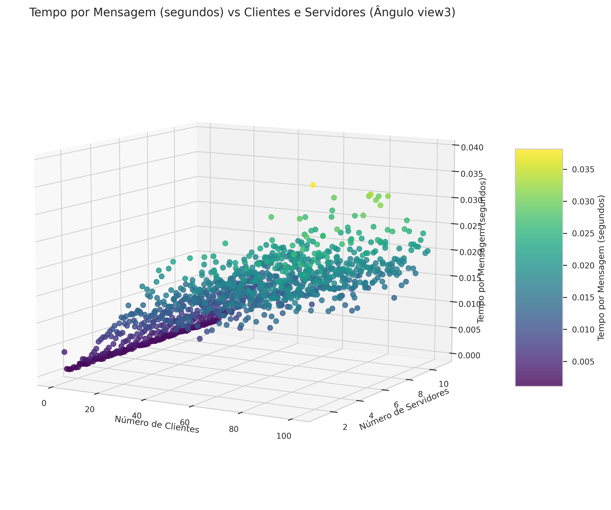
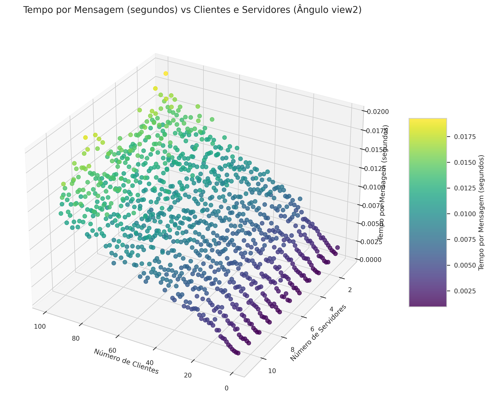
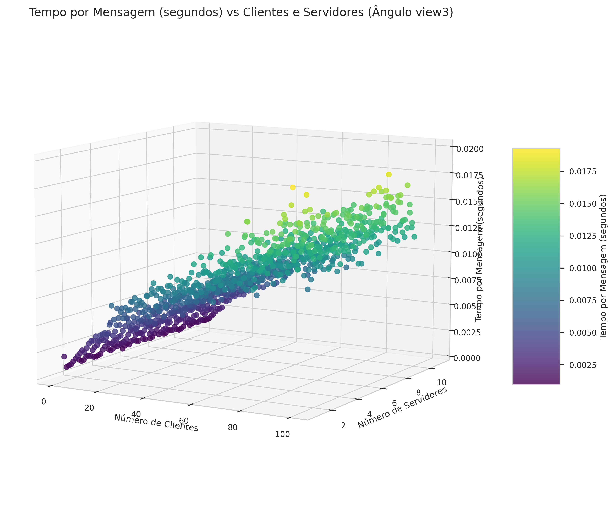
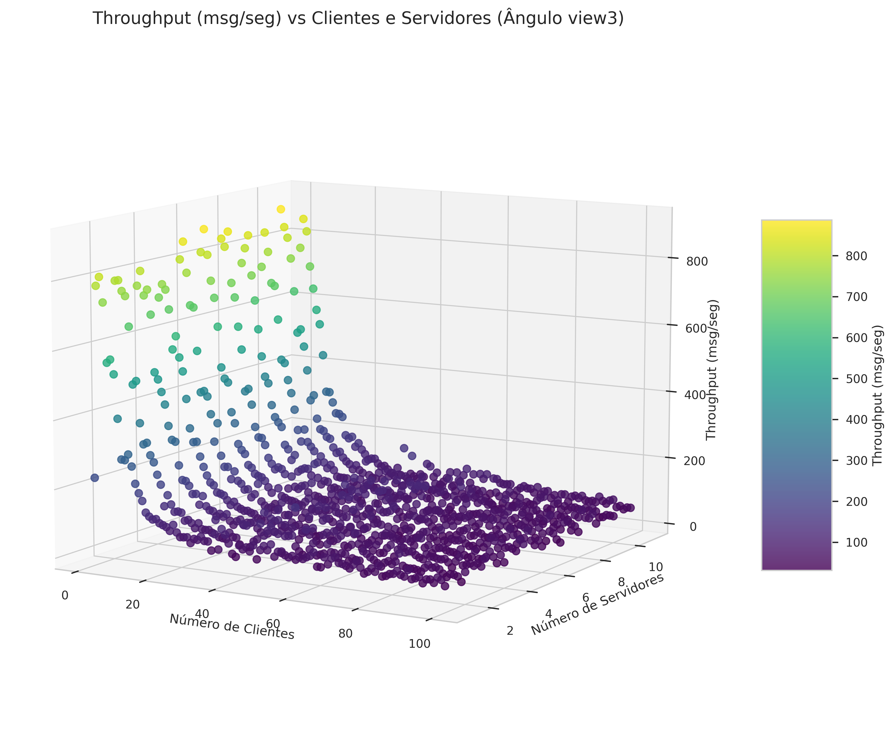
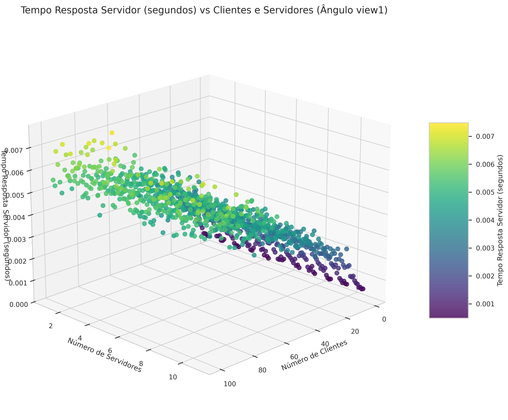

# projeto-kubernetes

Este projeto fornece a implementação e os resultados de uma série de experimentos em uma simulação de rede distribuída.

Foi utilizado o Kubernetes para criar a estrutura de rede que irá "receber" a carga e o Docker como software de containers.

# Experimentos de Carga

Todos os experimentos foram realizados variando o número de clientes de 1 a 100 e o número de servidores de 1 a 10. 

Para cada uma dessas configurações foi escolhida uma métrica para visualizar em um gráfico tri-dimensional.

Foram escolhidas as seguintes métricas:

- Tempo Médio Por Cliente
- Tempo Médio Por Mensagem
- Throughput Médio
- Tempo de Resposta do Servidor

# Resultados

## Dados Brutos

### Métrica: Tempo Médio Por Cliente

  <figure>
    
    <figcaption>Python</figcaption>
  </figure>
  <figure>
    
    <figcaption>Go</figcaption>
  </figure>

#### Python

#### Go

### Métrica: Tempo Médio Por Mensagem

#### Python

#### Go

### Métrica: Throughput Médio

#### Python

#### Go

### Métrica: Tempo de Resposta do Servidor

#### Python

#### Go

## Dados Tratados

---------------------------

Justificar os resultados (faz sentido a diferença de tempo que o python está tendo?)
Colocar a média de 5 execuções
Por que o python está caindo o tempo?

10 min e 5 min