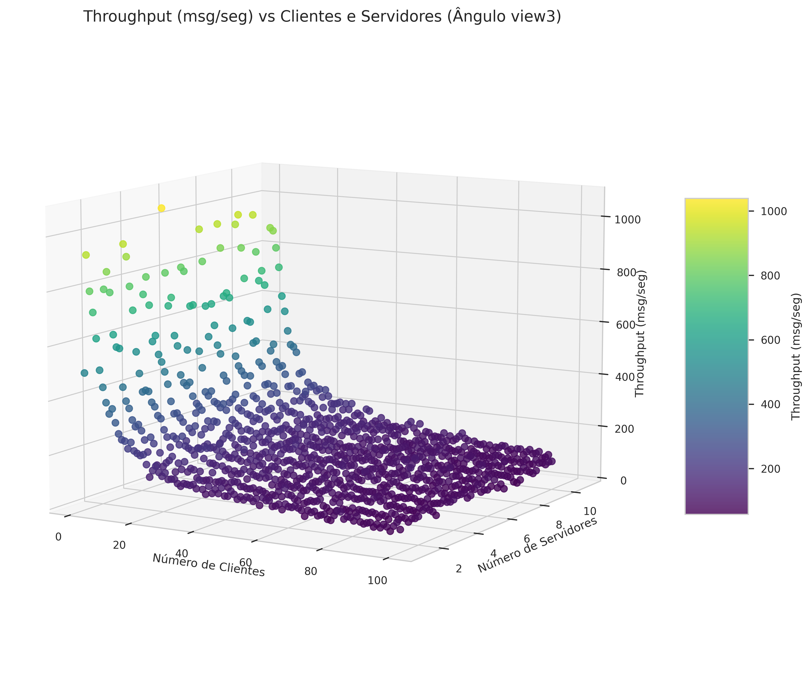
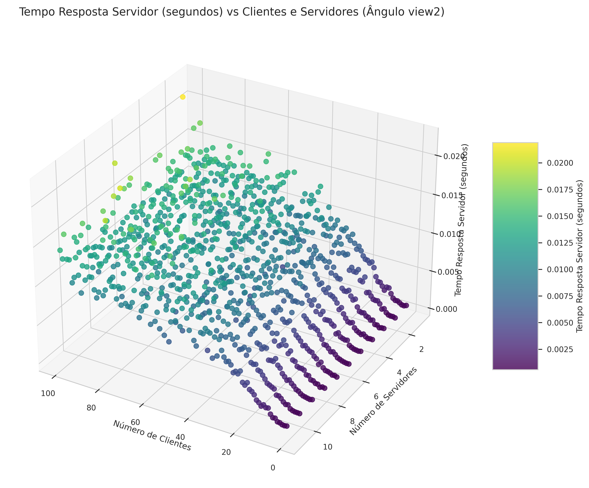
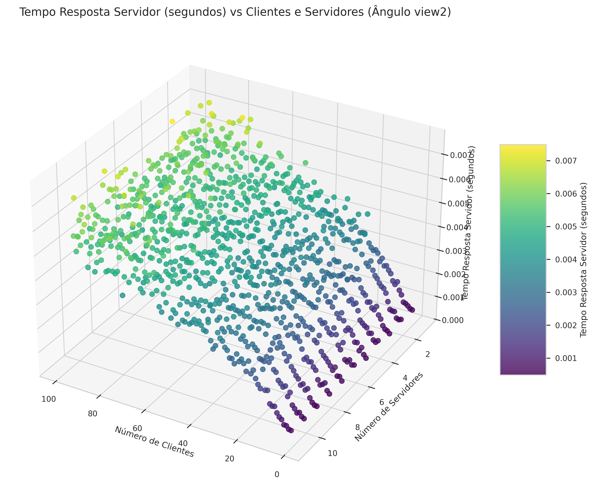

# projeto-kubernetes

Este projeto fornece a implementação e os resultados de uma série de experimentos em uma simulação de rede distribuída.

Foi utilizado o Kubernetes para criar a estrutura de rede que irá "receber" a carga e o Docker como software de containers.

# Experimentos de Carga

Todos os experimentos foram realizados variando o número de clientes de 1 a 100 e o número de servidores de 1 a 10. 

Para cada uma dessas configurações foi escolhida uma métrica para visualizar em um gráfico tri-dimensional.

Foram escolhidas as seguintes métricas:

- Tempo Médio Por Cliente
- Tempo Médio Por Mensagem
- Throughput Médio
- Tempo de Resposta do Servidor

# Resultados

## Dados Brutos

### Métrica: Tempo Médio Por Cliente

#### Python

#### Go

### Métrica: Tempo Médio Por Mensagem

#### Python

#### Go

### Métrica: Throughput Médio

#### Python

#### Go

### Métrica: Tempo de Resposta do Servidor

#### Python

#### Go

## Dados Tratados (Comparação)

  
  

 

  
  

 

  
  

 

  
  

 

  
  

A aparente pequena diferença de tempo entre as duas linguagens é justificada pela quantidade total de execuções realizadas. 

Para calcular a quantidade de execuções podemos usar a seguinte equação:

$$ 
{10}\sum_{i=1}^{100} i
$$

O resultado pode ser obtido através da fórmula da Soma de Gauss:

$$
\sum_{j=1}^{n} j = \frac{(n+1)n}{2}
$$

Assim:

$$
{10}\sum_{i=1}^{100} i = {10}\frac{(100 + 1)(100)}{2} = {10}\cdot{5050} = 50500
$$

Ou seja, há um total de 50500 execuções. Portanto uma pequena diferença de tempo pode resultar em uma grande diferença de tempo de execução total - como pode ser visto abaixo.

$$
\text{Média do Tempo por Cliente (Go)} = 0.043458
$$

$$
\text{Média do tempo por cliente (Python)} = 0.068338
$$

Fazendo uma estimativa de tempo de execução dos dois experimentos vamos obter:

#### Go
$$
0.043458 \cdot 50500 = 2194,629 \approx 36,5 \text{ minutos}
$$

#### Python
$$
0.068338 \cdot 50500 = 3451,069 \approx 57,5 \text{ minutos}
$$

Vale ressaltar que esses valores estão inflacionados pois não levam em consideração outros fatores importantes como o processamento em paralelo das execuções. Esse cálculo apenas evidencia a diferença no tempo de execução das duas linguagens. O tempo real das duas execuções foi de 20 minutos para o Python e 5 minutos para o Go.